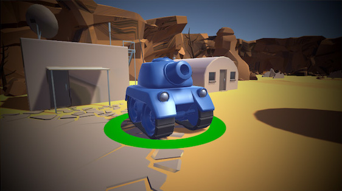

# FASTER

A mod for Art of Rally which enhances the sensations of speed.

#### Launcher Support

#### Platform Support

## Usage

Press Ctrl + F10 to open the mod manager menu.\
Adjust settings to select the effects you want.\
By default, the mod adds all speed effects with default values.

### General

- **Min speed threshold** : will decide at which speed the effects will start.
- **Max speed threshold** : will decide at which speed the effects will be at the maximum.
- **Effect up speed** : is the speed at which the effects will increase.
- **Effect down speed** : is the speed at which the effects will decrease.
- **Reset values** : behaves as a button to reset all values of this mod to default values.

### Lens distortion

- **Enable lens distortion** : will enable the Lens distortion effect.
- **Distortion intensity** : is the intensity of the lens distortion.

### Chromatic aberration

- **Enable chromatic aberration** : will enable the Chromatic aberration effect.
- **Aberration fast mode** : switches between fast mode (looks less good) and quality mode.
- **Aberration intensity** : is the intensity of the chromatic aberration.

### Bloom

- **Enable bloom** : will enable the Bloom effect.
- **Bloom threshold** : is the light threshold to get a bloom effect (lower will give more bloom). 
- **Bloom intensity** : is the intensity of the bloom.

### Vignette

- **Enable vignette** : will enable the vignette effect.
- **Vignette intensity** : is the amount of vignette.

### Debug

- **Test max effect** : will set the speed effect to it's max value, as if the car was going at *Max speed threshold*.
- **Disable info logs** : will disable the info logs.

Disabling the mod in the manager will reset the effects to their normal game values by default.

## Disclaimer

This mod was designed to be used with the [Camera mod](https://github.com/thoxx/aor-camera-mod) from Thoxx.
This mod might cause eye strain depending on the effects enabled.
This mod is significantly taxing on your PC's performances.

## Installation

Follow the [installation guide](https://www.nexusmods.com/site/mods/21/) of
the Unity Mod Manager.\
Then simply download the [latest release](https://github.com/MMike17/ArtOfRally_FASTER/releases/latest) and drop it into the mod manager's mods page.

## Showcase

